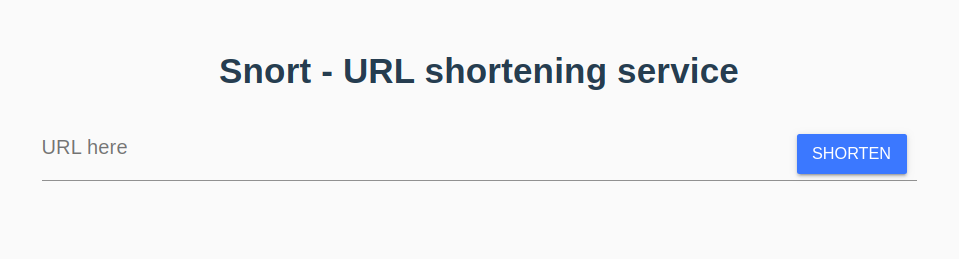

# Snort - URL shortening service

## Demo

Live demo TBD

## Requirements
* Docker & Docker Compose
* NodeJS + NPM

## Getting started
1. Copy .env.dist to .env
2. `npm run dev` to start the stack of containers
3. Open http://localhost:8081

## Technology used
* Laravel
* VueJS
* Docker
* Nginx
* Terraform
* AWS
